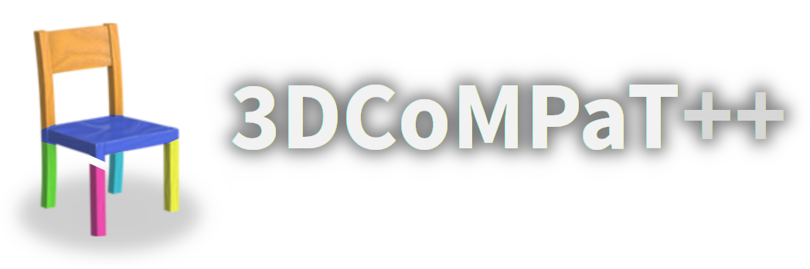
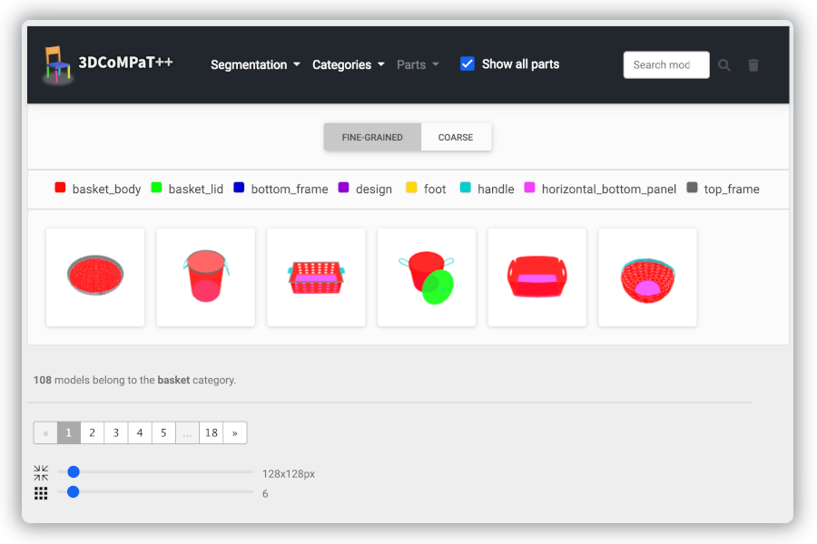

<div align="center">
<p align="center">
     
</p> 
<h1 align="center">
</h1>
<h1 align="center">
    3DCoMPaT++: An improved Large-scale 3D Vision Dataset for Compositional Recognition
</h1>

[](https://colab.research.google.com/drive/1OpgYL_cxekAqZF8B8zuQZkPQxUIxzV0K?usp=sharing)
[](https://3dcompat-dataset.org/doc/)
[](https://3dcompat-dataset.org/)
[](https://3dcompat-dataset.org/workshop/)
[](https://eval.ai/web/challenges/challenge-page/2031)

</div>

## Summary

- [Introduction](#📚-introduction)
- [Getting started](#🚀-getting-started)
- [Baselines](#📊-baselines)
- [Challenge](#🏆-challenge)
- [Acknowledgments](#🙏-acknowledgments)
- [Citation](#citation)

<br>


<br>

## 📚 Introduction

3DCoMPaT++ is a multimodal 2D/3D dataset of 16 million rendered views of more than 10 million stylized 3D shapes carefully annotated at **part-instance** level, alongside matching **RGB pointclouds**, **3D textured meshes**, **depth maps** and **segmentation masks**. This work builds upon [3DCoMPaT](https://3dcompat-dataset.org/), the first version of this dataset.

**We plan to further extend the dataset: stay tuned!** 🔥

<br>

## 🔍 Browser

To explore our dataset, please check out our integrated web browser:

<a href="https://3dcompat-dataset.org/browser">
    <p align="center">
    
    </p>
</a>

For more information about the shape browser, please check out [our dedicated Wiki page](https://3dcompat-dataset.org/doc/browser.html).

<br>

## 🚀 Getting started

To get started straight away, here is a Jupyter notebook (no downloads required, just **run and play**!):

[](https://colab.research.google.com/drive/1OpgYL_cxekAqZF8B8zuQZkPQxUIxzV0K?usp=sharing)

For a deeper dive into our dataset, please check our online documentation:

[](https://3dcompat-dataset.org/doc/)

<br>

## 📊 Baselines

We provide baseline models for 2D and 3D tasks, following the structure below:

- **2D Experiments**
  - [2D Shape Classifier](./models/2D/shape_classifier/): ResNet50
  - [2D Part and Material Segmentation](./models/2D/segmentation/): SegFormer
- **3D Experiments**
  - [3D Shape classification](./models/3D/): DGCNN - PCT - PointNet++ - PointStack - Curvenet - PointNext - PointMLP
  - [3D Part segmentation](./models/3D/): PCT - PointNet++ - PointStack - Curvenet - PointNeXT

<br>

## 🏆 Challenge

As a part of the [C3DV CVPR 2023 workshop](https://3dcompat-dataset.org/workshop/), we are organizing a modelling challenge based on 3DCoMPaT++.
To learn more about the challenge, check out this link:

[](https://eval.ai/web/challenges/challenge-page/2031)

<br>

## 🙏 Acknowledgments

⚙️ For computer time, this research used the resources of the Supercomputing Laboratory at [King Abdullah University of Science & Technology (KAUST)](https://www.kaust.edu.sa/).
We extend our sincere gratitude to the [KAUST HPC Team](www.hpc.kaust.edu.sa) for their invaluable assistance and support during the course of this research project. Their expertise and dedication continues to play a crucial role in the success of our work.

💾 We also thank the [Amazon Open Data](https://aws.amazon.com/opendata) program for providing us with free storage of our large-scale data on their servers. Their generosity and commitment to making research data widely accessible have greatly facilitated our research efforts.

</br>

## Citation

If you use our dataset, please cite the two following references:

```bibtex
@article{slim2023_3dcompatplus,
    title={3DCoMPaT++: An improved Large-scale 3D Vision Dataset
    for Compositional Recognition},
    author={Habib Slim, Xiang Li, Yuchen Li,
    Mahmoud Ahmed, Mohamed Ayman, Ujjwal Upadhyay
    Ahmed Abdelreheem, Arpit Prajapati,
    Suhail Pothigara, Peter Wonka, Mohamed Elhoseiny},
    year={2023}
}
```

```bibtex
@article{li2022_3dcompat,
    title={3D CoMPaT: Composition of Materials on Parts of 3D Things},
    author={Yuchen Li, Ujjwal Upadhyay, Habib Slim,
    Ahmed Abdelreheem, Arpit Prajapati,
    Suhail Pothigara, Peter Wonka, Mohamed Elhoseiny},
    journal = {ECCV},
    year={2022}
}
```

</br>

This repository is owned and maintained by <a href="https://habibslim.github.io/">Habib Slim</a>, <a href="https://xiangli.ac.cn/">Xiang Li</a>, <a href="mahmoudalsayed@aucegypt.edu">Mahmoud Ahmed</a> and <a href="https://personal-website-mohamedayman15069.vercel.app/">Mohamed Ayman</a>, from the <a href="https://cemse.kaust.edu.sa/vision-cair">Vision-CAIR</a> group.

## References

1. _[Li et al., 2022]_ - 3DCoMPaT: Composition of Materials on Parts of 3D Things.
2. _[Xie et al., 2021]_ - SegFormer: Simple and Efficient Design for Semantic Segmentation with Transformers.
3. _[He et al., 2015]_ - Deep Residual Learning for Image Recognition.
